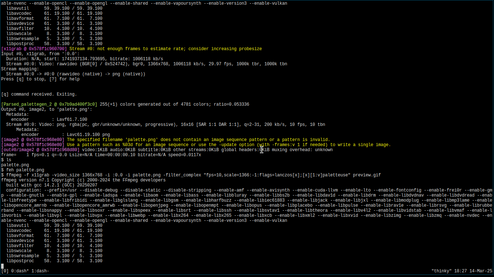

# Typc

Typc is a lightweight, console-based typing trainer written in C.

## About

Typc is a minimalistic, console-based typing trainer. It focuses on core
functionality without relying on complex command line parsing libraries.
Despite its simplicity, Typc offers several useful features to help improve
your typing speed and accuracy.

## Features

Typc provides a detailed analysis of your typing performance by comparing your
input to a randomly selected text. After completing a test, you will see your
performance statistics on the **Results Page**.

### Results Page

#### Words per minute

This metric calculates the number of words you would have typed in 1 minute.

#### Characters per minute

This shows the number of characters you would have typed per minute.

#### Accuracy

Accuracy is determined by the number of correctly typed characters relative to
the total characters in the text:

$$
accuracy = \frac{correct\text{ }characters \cdot 100}{total\text{ }characters}
$$

#### Consistency

Consistency measures the proportion of keystrokes made without errors, even if
the mistakes were later corrected:

$$
consistency = \frac{(keystrokes - errors) \cdot 100}{keystrokes}
$$

## Purpose

Typc was created to address the lack of open-source, command-line-based typing
trainers. While there are alternatives built with languages like Rust (e.g.,
Typerr), they often require additional dependencies. By building Typc in C, it
can be easily cross-compiled and offers high performance without extra
installation overhead.

## Naming

The name "Typc" is inspired by an existing Rust typing trainer named Typerr.
The name was adapted by modifying it slightly and appending a "C" to signify
that this program is written in C.

## Usage

To use Typc, simply run the executable from the source directory. This is
important because the program relies on relative I/O paths. For example, the
`texts` directory must be located in the same directory where the executable is
run. Running Typc from a directory without the required structure (e.g.,
`~/Downloads/typc` without a `texts` folder) will result in errors.

## Text Selection

The program scans all files within the `texts` directory and selects one at
random. The random number generator is seeded with the current time, ensuring a
different order of text selection each time you run the program.

## Adding New Texts

Adding new texts is straightforward. Create a new file in the `texts` directory.
While you can name the file anything, it's best to use descriptive names. For
example, if the text is a Bible verse, you might name it
`bible_verse_corinthians_12.txt`. The default texts are similarly named to
reflect their content.
